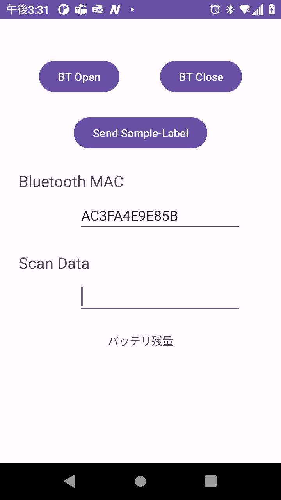

## Bluetooth 印刷デモ用のAndroid Apkとソースコード

### 概要

- Bluetooth 接続経由のラベル印刷パフォーマンスをデモするためのツール。
- Android用のBluetooth 接続経由のラベル印刷アプリを開発する方向けにソースコードを提供。

### テスト済み環境

- ET4x/A11
- TC21/A11
- EC5x/A11
- ZQ3+, ZQ5, ZQ6, ZD621, ZT4x1

 

### デモアプリインストール方法

※ Android端末上の操作
 

1. DataWedge を起動する。
1. Profile0 > キーストローク出力 > 基本データフォーマット > "Enterキー送信"をチェック 
1. demo-app-debug.apkをAndroid端末上で実行し、インストール。
1. アプリ[My Application]を起動。 

 

### デモアプリ操作方法

    

1. プリンタのBluetooth MAC を入力する。
1. "BT Open" ボタン押下。
1. プリンタとBluetooth 接続できていることを確認。
1. "Scan Data" にカーソルを合わせて、バーコード*をスキャン。  
    　\* JAN コードを推奨
1. ラベルが印刷される。 

 

### ファイル構成

| データ | 内容 |
|-|-|
| ./demo-app-debug.apk | デモアプリ
| Print_Dynamic01 フォルダ  | Android プロジェクト一式
